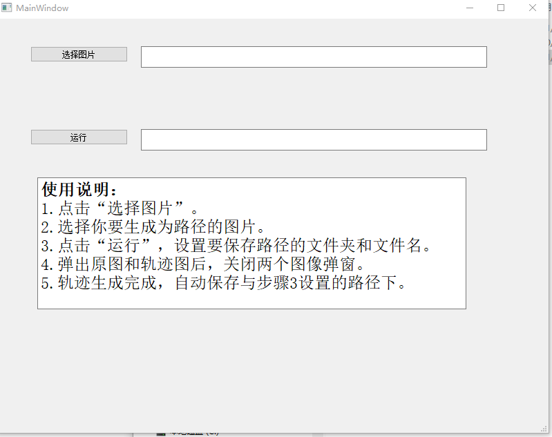
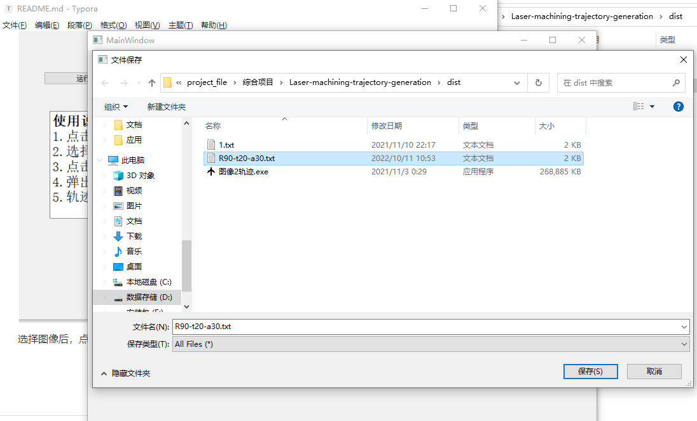
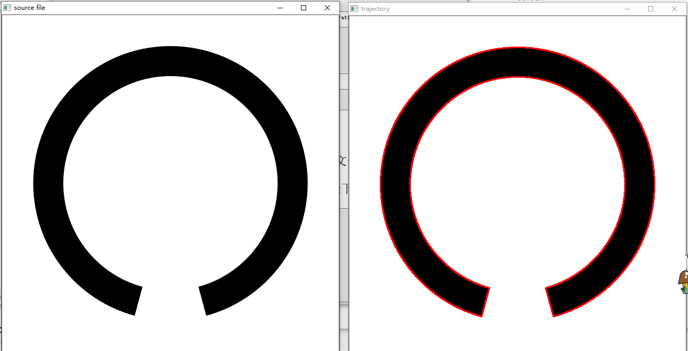

README

## 功能

本程序用于从.png图像中识别白色图案的边缘轨迹，并生成位移数组。该位移数组可用于二维平面激光加工。

## 示例

使用的图像类似下图：

点击选择图像后，选择要识别轨迹的图像：

选择图像后，点击运行，选择轨迹数组要保存的位置，并为文件起名，点击保存：

识别完毕后，会弹出两个窗口，“source file”和“trajectory”，检测“trajectory”中轨迹是否和预期一致，然后关闭两个窗口后，轨迹文件生成在设定位置。

## 注意

图片可以用PPT绘制后用PS缩放，黑色图案边缘为轨迹，在使用本程序识别前，请将图像缩放到1像素=1 um。